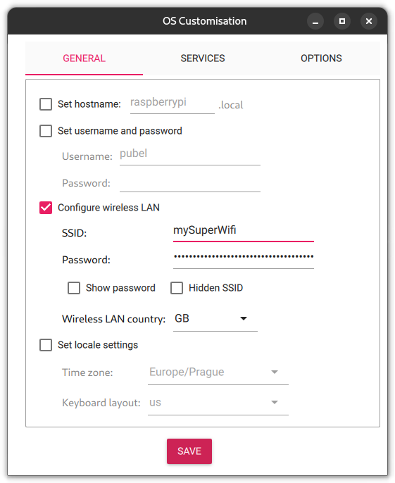

# Raspberry Pi Image
## Downloading image 

Download image from [releases page](https://github.com/pstrobl96/prusa_exporter/releases) or alternatively you can choose CI pipeline run and download particular artifact. Downloaded *img.xz* file is named prusa_exporter_{version}.img.xz and needs to be flashed to the memory card.

## Raspberry Pi Imager

[Download](https://www.raspberrypi.com/software/) and install Raspberry Pi Imager. You can alternatively use different tool but rpi-imager is easiest in terms of settings.  

After installing open the Raspberry Pi Imager. **Don't** click `Choose Device` instead of that click on `Choose OS`. Scroll down, you'll find `Use Custom`. Select downloaded image.  

Now connect memory card to your computer and click `Choose Storage`. **BEWARE** - you can mistakenly choose wrong storage media and flashing process includes formating your drive. Now select your Raspberry Pi memory card. Now click `Next`.

Now it depends if you want to connect via LAN or WiFi.

### WiFi

If you want to use wireless ethernet, then click at `Edit Settings`. Click at `Configure wireless LAN` and write your WiFi name (SSID) and password. Don't forget to select correct Wireless LAN country. Next be sure that `Eject media when finished` is **unchecked** . Click `Save` and after that click on `Yes`. If you are sure that all content of your memory card would be erased, click `Yes`.

### LAN

If you want to use wired ethernet, then click at `Edit Settings`, click `Options` and be sure that `Eject media when finished` is **unchecked** . Click `Save` and after that click on `Yes`. If you are sure that all content of your memory card would be erased, click `Yes`.

## Flashing

Now wait for the Raspberry Pi Imager to complete the flash process.

## Config

Now we need to configure *Grafana Agent* and *prusa_exporter*. After flashing you should see new partition connected to system, can be called `boot` or `bootfs`. In Windows you'll get also letter of partition, nowadays most probably `D:` - can varies. If you don't see new partition. Eject memory card from the system and reconnect it. 

In boot partition you'll find two files `agent.yaml` and `prusa.yml`. Configuration is mentioned in next part of README.

How to configure `prusa.yml` you can find in [exporter.md](exporter.md) and in [config.md](config.md) you'll find how to configure Grafana Agent.