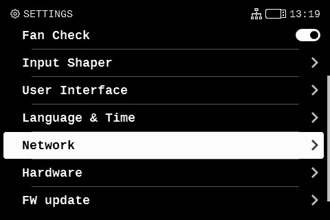
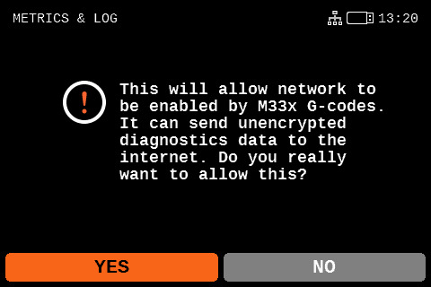
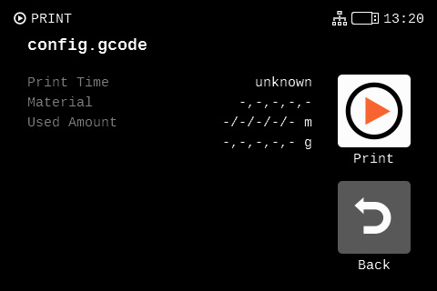

# Enable SYSLOG in printer

Another issue with SYSLOG is configuration. You need munually enable sending metrics in printers GUI - step by step bellow. And you need to run specific gcode file, that specifies SYSLOG server. 

With M330 and M334 g-code you can configure your SYSLOG server and there are two ways how to get needed g-code. I've created  containing everything needed. **You just need to change IP address and you can change port. however while testing I had issues with numerous text editors and printer was very picky.** I was successful with `nano` and basic `echo` command in terminal. However you can as well activate additional metrics that can be found here . If you enable additional metrics then you need to run your configuration gcode after rebooting the printer. 

Second way is to add these two lines in to start of g-code with PrusaSlicer. Don't forget to change IP address and port! `10008` is default that I used but use whatever you want but you need also change that value in configuration.
```
M330 SYSLOG
M334 192.168.20.2 10008
```

For logs you can use `M340`. 

```
M340 192.168.20.2 10007
```

Or you can combine both and you'll get

```
M330 SYSLOG
M334 192.168.20.2 10008
M340 192.168.20.2 10007
```

After loading gcode on to flash drive you can enable the metrics in printer.

Open `Settings`  


Navigate to `Network`  


Find `Metrics & Log`  


Now click on `Allow` - Confirm and change value to `Any Host`. Next switch on `Enabled Stored at Startup`  




Now run your configuration gcode we created before



Navigate back to `Metrics & Log` and find `Current Configuration` - click on `Metrics Host` and store it as Host   


Click on `Metrics Port` and store it as Metrics Port  


After configuration it should look like this. Only IP address should be different. And if different port was choosen then also port.  


